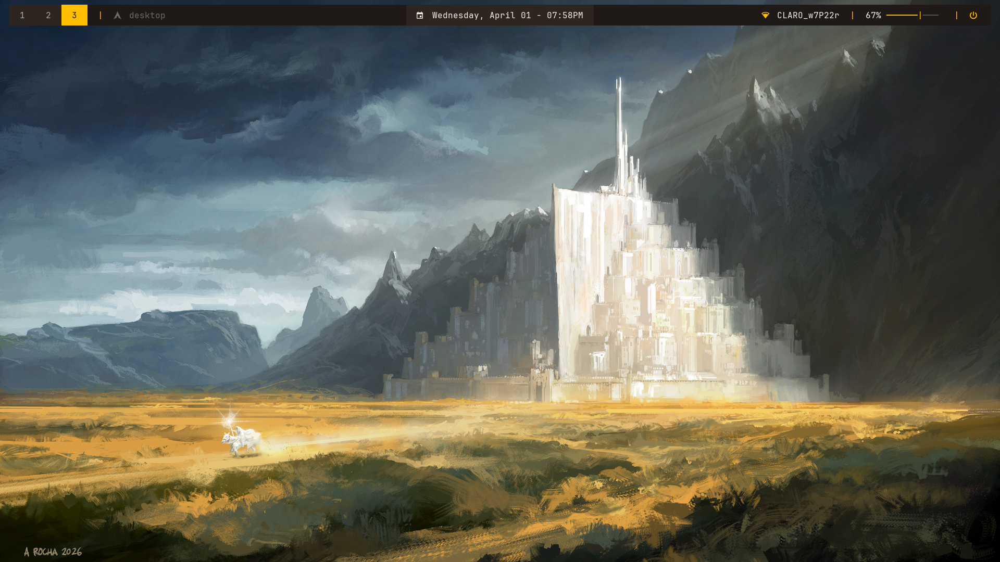

 # dotfiles
Aqui se encuentran almacenados mis archivos de configuracion de Linux

## Inspiraciones Tomadas
### Desktops
- [r/unixporn // arya71 - [i3] Made some changes](https://www.reddit.com/r/unixporn/comments/1mjhqxp/i3_made_some_changes/) | [dotfiles](https://github.com/aryaio/i3wm-config/tree/main)
- [r/unixporn // SuwaYuzuru - [i3] my current i3wm nord rice](https://www.reddit.com/r/unixporn/comments/1nasetc/i3_my_current_i3wm_nord_rice/) | [dotfiles](https://github.com/srchby/dotfiles/tree/master)
- [r/unixporn // sabrehagen - [i3] my first rice](https://www.reddit.com/r/unixporn/comments/1r84iim/i3_my_first_rice/) | [dotfiles](https://github.com/sabrehagen/desktop-environment?tab=readme-ov-file)
- [r/unixporn // 23chappellen - [dwm] My Daily Driver](https://www.reddit.com/r/unixporn/comments/1r7ilwx/dwm_my_daily_driver/#lightbox) | [dotfiles](https://codeberg.org/binkd/dotfiles)
- [r/unixporn // Di3g0x29 - [dwm] Void linux and monochrome all day](https://www.reddit.com/r/unixporn/comments/11k9wad/dwm_void_linux_and_monochrome_all_day/) | [dotfiles](https://git.disroot.org/d13g0x/dotfiles)
- [r/unixporn // yuvayikici - [dwm] Cute cat and minimalism.](https://www.reddit.com/r/unixporn/comments/1pfsj3z/dwm_cute_cat_and_minimalism/) | [dotfiles](https://github.com/merthium/dwm)
- [r/unixporn // Spiritted_Month_7071 - [dwm] First rice!](https://www.reddit.com/r/unixporn/comments/1re4vru/dwm_first_rice/) | [dotfiles](https://github.com/Abhijithmns/dotfiles)
- [r/unixporn // Dragoonfx00 - [dwm] Well, what do you say?](https://www.reddit.com/r/unixporn/comments/un7we2/dwm_well_what_do_you_say/) | [dotfiles](https://github.com/junnunkarim/dotfiles_home/tree/6aaf55bf471dd3433a80237f4c873b38380c73d1?tab=readme-ov-file)
- [r/unixporn // dpatel11- [dwm] my daily driver](https://www.reddit.com/r/unixporn/comments/1nmvdcu/dwm_my_daily_driver/) | [dotfiles](https://github.com/DPatel0211/dotfiles)

### Rofi
- [github // adi1090x - powermenu for rofi](https://github.com/adi1090x/rofi/blob/master/previews/powermenu/type-2/1.png) | [source](https://github.com/adi1090x/rofi)
- [r/unixporn // [OC] Few rofi themes](https://www.reddit.com/r/unixporn/comments/qj1c24/oc_few_rofi_themes/) | [source](https://github.com/yuky2020/rofi-themes)
